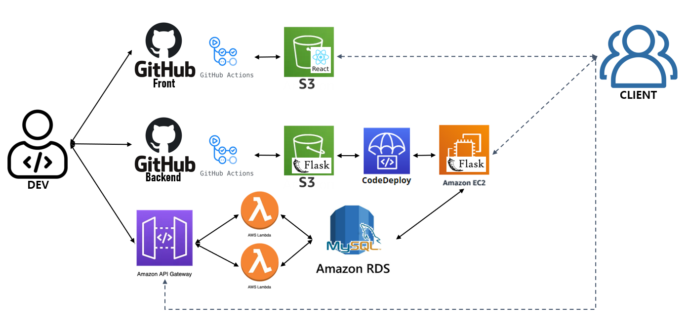
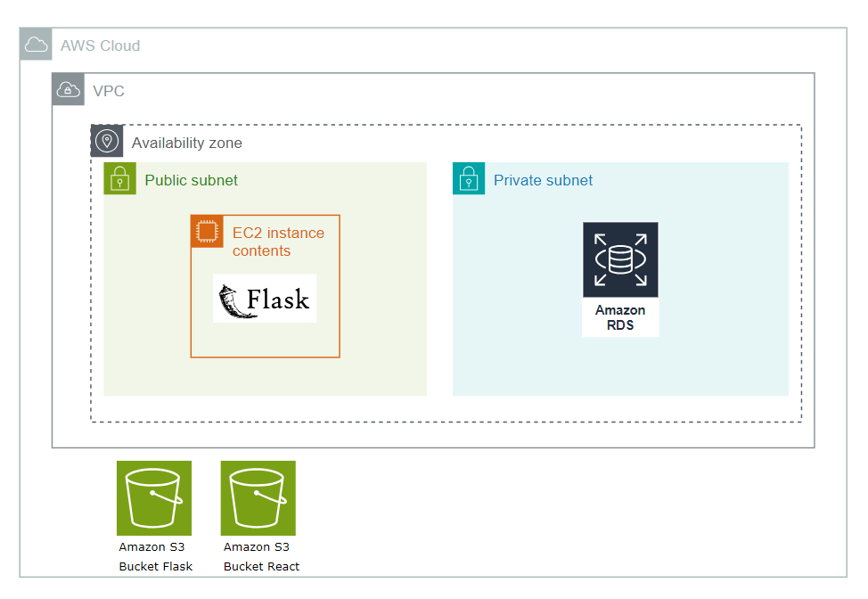

<h1 align="center">Welcome to FIRST STEP </h1>
<p>
</p>
<center>
    
</center>
<br>
> First Step / 한걸음 대여소 (신세계 I&C 3rd 모듈 프로젝트)

##### 🏠[GitHub_Backend](https://github.com/Kwak-Minju/FIRSTSTEP_BE) 🏠[GitHub_Front](https://github.com/Kwak-Minju/FIRSTSTEP_FE) 🏠[GitHub_Front_AWS](https://github.com/Kwak-Minju/FIRSTSTEP_FE_AWS) 🏠[GitHub_Backend_AWS](https://github.com/Kwak-Minju/FIRSTSTEP_FE_AWS) 

## 1. 프로젝트 소개🏆
```sh
- 이전에 개발한 한걸음대여소 웹 어플리케이션을 AWS 아키텍처 설계
- GitHub Actions와 AWS CodeDeploy를 통한 CI/CD 구축
```
### 1.1 프로젝트 멤버
```sh
🐯 곽민주
```
### 1.2 기술 스택

- Front-end
    


- Backend
 
- Database

- Infra

- CI/CD


## 2. AWS Architecture🏛️
<center>
        
</center>

### 2-1. Frontend
```sh
- 정적 웹 호스팅을 위한 S3 Bucket 생성
- GitHub Action을 통해 변경사항 생성 시 React 어플리케이션 빌드 후 S3 Bucket에 업로드
```
### 2-2. Backend
```sh
- Backend API 일부는 API Gateway를 생성하여 Lambda 함수에 엑세스
- GitHub Action을 통해 변경사항 생성 시 자동으로 S3 Bucket에 업로드
- AWS CodeDeploy를 통해 flask 서버 배포 자동화
```

### 2-3. DB
```sh
- AWS RDS를 사용하여 MySQL 데이터베이스 생성
```
## 3. Infra Architecture
<center>
        
</center>

### 3-1. 진행과정상세
- AWS GUI 환경
  https://kalswn.tistory.com/entry/AWS-Flask-MySQL-react-%EB%B0%B0%ED%8F%AC

## 4. CI/CD 구축

### 4.1 Frontend workflows
```yaml
name: Deploy to Amazon S3 bucket

on:
  push:
    branches: [ "main" ]

env:
  AWS_REGION: ap-northeast-2
  S3_BUCKET_NAME: fs-front-bucket
  
permissions:
  contents: read
  id-token: write

jobs:
  build:
    runs-on: ubuntu-latest
    environment: production
    steps:
      - name: Checkout
        uses: actions/checkout@v3
      
      - name: ls
        run: ls -al

      - name: Cache node modules
        uses: actions/cache@v3
        with:
          path: ~/.npm
          key: ${{ runner.os }}-node-${{ hashFiles('**/package-lock.json') }}      
      - if: steps.npm-cache.outputs.cache-hit == 'true'
        run: echo 'npm cache hit!'
      - if: steps.npm-cache.outputs.cache-hit != 'true'
        run: echo 'npm cache missed!'

      - name: Install Dependencies
        if: steps.cache.outputs.cache-hit != 'true'
        run: npm install

      - name: Build
        run: npm run build

      - name: Remove template files
        run: rm -rf node_modules public src index.html package*
  
      - name: Configure AWS credentials
        uses: aws-actions/configure-aws-credentials@v1
        with:
          aws-access-key-id: ${{ secrets.AWS_ACCESS_KEY_ID }}
          aws-secret-access-key: ${{ secrets.AWS_SECRET_ACCESS_KEY }}
          aws-region: ${{ env.AWS_REGION }}

      - name: upload to S3
        run: aws s3 sync build/ s3://${{ env.S3_BUCKET_NAME }} --acl public-read
        env:
          AWS_ACCESS_KEY_ID: ${{ secrets.AWS_ACCESS_KEY_ID }}
          AWS_SECRET_ACCESS_KEY: ${{ secrets.AWS_SECRET_ACCESS_KEY }}
```
```sh
steps 1.code checkout
      2.module cache 확인
      3.module 설치
      4.react 어플리케이션 빌드
      5.불필요한 module 및 파일 삭제
      6.IAM 자격 증명
      7.S3 업로드
```

### 4.2 Backend workflows
```yaml
name: CI/CD to Amazon EC2

on:
  push:
    branches: [ "main" ]

env:
  AWS_REGION: ap-northeast-2
  S3_BUCKET_NAME: fs-back-bucket
  CODE_DEPLOY_APPLICATION_NAME: FlaskApplication
  CODE_DEPLOY_DEPLOY_GROUP_NAME: FlaskApplicationDeployGroup

permissions:
  contents: read

jobs:
  deploy:
    name: Deploy
    runs-on: ubuntu-latest
    environment: production
    steps:
    - name: Checkout
      uses: actions/checkout@v3

    - name: Configure AWS credentials
      uses: aws-actions/configure-aws-credentials@v1
      with:
        aws-access-key-id: ${{ secrets.AWS_ACCESS_KEY_ID }}
        aws-secret-access-key: ${{ secrets.AWS_SECRET_ACCESS_KEY }}
        aws-region: ${{ env.AWS_REGION }}

    - name: Upload to AWS S3
      run: |
        aws deploy push \
          --application-name ${{ env.CODE_DEPLOY_APPLICATION_NAME }} \
          --s3-location s3://$S3_BUCKET_NAME/$GITHUB_SHA.zip \
          --ignore-hidden-files \
          --source . 

    - name: Deploy to AWS EC2 from S3
      run: |
        aws deploy create-deployment \
          --application-name ${{ env.CODE_DEPLOY_APPLICATION_NAME }} \
          --deployment-config-name CodeDeployDefault.AllAtOnce \
          --deployment-group-name ${{ env.CODE_DEPLOY_DEPLOY_GROUP_NAME }} \
          --s3-location bucket=$S3_BUCKET_NAME,key=$GITHUB_SHA.zip,bundleType=zip
```
```sh
steps 1.코드 checkout
      2.IAM 자격 증명
      3.S3 업로드
      4.EC2 배포
```
### 4.3 Github Action 및 CodeDeploy 상세
- https://kalswn.tistory.com/entry/AWS-CodeDeploy-Flask
- https://kalswn.tistory.com/entry/AWS-GitHub-Actions-react